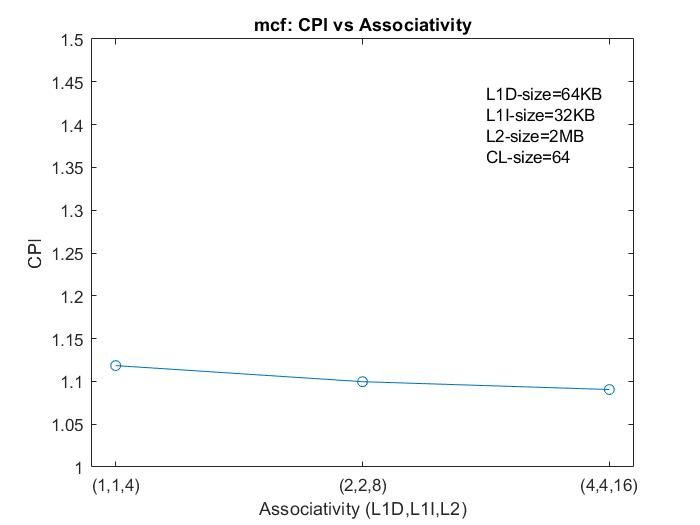
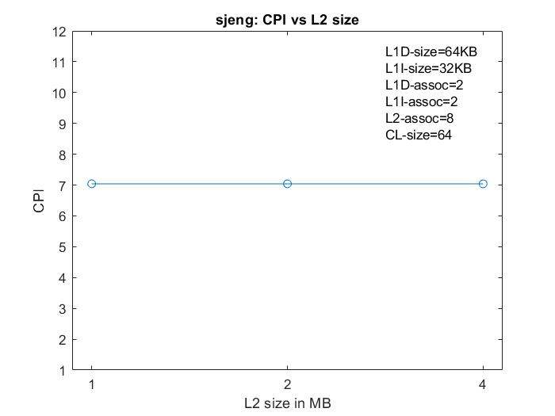

# COMPUTER ARCHITECTURE
## LAB 2  Gem5

_Falis Konstantinos_  
_Valasiadou Panagiota_

### **Task 1.a** 

* **Cache Size:**   
**options.py**

  1.L1d size: 64kB 
  > parser.add_option("--l1d_size", type="string", default="64kB")[line:119]   

  2.L1i size: 32kB    
  > parser.add_option("--l1i_size", type="string", default="32kB")[line:120]

  3.L2 size: 2MB  
  >parser.add_option("--l2_size", type="string", default="2MB")[line:121]  

* **Associativity:**  
**options.py**  

  1.L1d assoc: 2    
  >parser.add_option("--l1d_assoc", type="int", default=2)[line:123]  
   
   2.L1i assoc: 2  
   >parser.add_option("--l1i_assoc", type="int", default=2)[line:124]    
   
   3.L2 assoc: 8  
   >parser.add_option("--l2_assoc", type="int", default=8) [line:125]
 

 * **Cache Line Size:**  
  **se.py**

   >system = System(cpu = [CPUClass(cpu_id=i) for i in range(np)],   
                mem_mode = test_mem_mode,  
                mem_ranges = [AddrRange(options.mem_size)],  
                cache_line_size = options.cacheline_size)   [lines:176-180]

    **options.py**  
    >parser.add_option("--cacheline_size", type="int", default=64) [line:127]
  

  ### **config.ini**  

* **L1d:**  
  
  >[system.cpu.dcache]  
  assoc=2  
  size=65536

* **L1i:**  
  
  >[system.cpu.icache]  
  assoc=2  
  size=32768

* **L2:**  

  >[system.l2]  
  assoc=8  
  size=2097152

* **Cache Line Size:**  
  >[system]  
  cache_line_size=64

### **Task 1.b** 
### **stats.txt**  

* **401.bzip2**  |  |
    ---|---  
	 sim_seconds  |                               0.086956   
	 system.cpu.cpi                |               1.739123    
	 system.cpu.icache.overall_miss_rate::total  | 0.000060  
    system.cpu.dcache.overall_miss_rate::total |  0.014599   
    system.l2.overall_miss_rate::total    |       0.266697  

* **456.hmmer** | |
    ---|---
	|sim_seconds                 |                 0.059431   
	|system.cpu.cpi               |                1.188625   
	|system.cpu.icache.overall_miss_rate::total  | 0.000128  
    |system.cpu.dcache.overall_miss_rate::total |  0.001625   
    |system.l2.overall_miss_rate::total          | 0.083085   

 * **470.lbm**  | |
    ---|---
	sim_seconds    |                              0.174681   
	system.cpu.cpi       |                        3.493624  
	system.cpu.icache.overall_miss_rate::total |  0.000105  
    system.cpu.dcache.overall_miss_rate::total  | 0.060971   
    system.l2.overall_miss_rate::total         |  0.999946   
   
* **429.mcf**   |stats
    ---|---
	|sim_seconds                  |                0.056131  
	|system.cpu.cpi                             |  1.122612   
	|system.cpu.icache.overall_miss_rate::total |  0.000039  
	|system.cpu.dcache.overall_miss_rate::total |  0.002168  
    |system.l2.overall_miss_rate::total         |  0.701421   
   
* **458.sjeng**   ||
    ---|---
	|sim_seconds                             |     0.513520   
	|system.cpu.cpi                             |  10.270404   
	|system.cpu.icache.overall_miss_rate::total  | 0.000015  
    |system.cpu.dcache.overall_miss_rate::total |  0.121831  
    |system.l2.overall_miss_rate::total          | 0.999945     
      
### **GRAPHS:**  

 ### **1.Execution time (sim_seconds)**

 

### **2.Cycles Per Instruction (CPI)**

### **3.L1 Instruction Cache Miss Rate**

### **4.L1 Data Cache Miss Rate**

### **5.L2 Cache Miss Rate**

    We can observe that the execution time and CPI for each benchmark are strongly related. Also, the miss rate of L1D cache seems to have the biggest correlation with the execution time and CPI, compared to the other miss rates.

### **Task 1.c** 

### **stats.txt** 

* **cpu-clock=1GHz**  
  >system.clk_domain.clock                          1000  
   [Clock period in ticks]  
   system.cpu_clk_domain.clock                      1000   
   [Clock period in ticks]

* **cpu-clock=2GHz**  
  >system.clk_domain.clock                          1000  
   [Clock period in ticks]  
   system.cpu_clk_domain.clock                      500   
   [Clock period in ticks]

The **system clock** is needed to synchronize all components on the motherboard.The **CPU clock** has the same purpose, but is only used on the chip itself. Because the CPU needs to perform more operations per time than the motherboard, the CPU clock is much higher. And because we don't want to have another oscillator (e.g. because they also would need to be synchronized), the CPU just takes the system clock and multiplies it by a number, which is either fixed or unlocked.

### **config.json**

* **cpu-clock=2GHz**

  >"clk_domain": {"name": "clk_domain", "clock": [1000],...}

  >"cpu_clk_domain": {"name": "cpu_clk_domain", "clock": [500],...}      
  
**Adding a second core :**  
(--num-cpus=2)  
(cpu0, cpu1)
  >system.clk_domain.clock                          1000     
[Clock period in ticks]  
system.cpu_clk_domain.clock                       500   
[Clock period in ticks]

_All cores(cpu0,cpu1) have the same clock as it is expected._   

### **Scaling**  

benchmark|cpu clock:|1GHz|2GHz|4GHz
---|---|---|---|---
|401.bzip2:|  |   0.166561   |          0.086956 	 |   	0.047382
456.hmmer:|   |  0.118453  |            0.059431		|	0.029822
470.lbm:  |   |  0.262355       |        0.174681		|	0.132673
429.mcf:  |    |  0.109967        |      0.056131		|	 0.028977
458.sjeng:  | | 0.704097       |       0.513520    |    	0.417614 
			
	
Scaling is almost perfect for bzip2, mcf,hmmer but not for sjeng,lbm.
The reason is that bzip2, mcf,hmmer,are benchmarks that measure compute-intensive integer performance while lbm is for compute-intensive floating point performance.
Floating point data need more memory that can't fit in cache so the increase of the cpu-clock rate(the decrease of the sim_seconds/execution time) is limited by the latency from memory acceses.
Also for sjeng there isn't a perfect scaling and one reason is that it creates a tree of possible chess moves so it needs a lot of memory.Often accesses occuring in lower memory levels makes it difficult for the cpu-clock rate to scale with sim_seconds/execution time.

### **Task 2.a**  
Results after running the benchmarks with different parameters:  
>_model naming_ :  **spec**[_name of benchmark_]**_L1D**([_size of L1D_],[_associativity of L1D_])**_L1I**([_size of L1I_],[_associativity of L1I_])**_L2**([_size of L2_],[_associativity of L2_])**_CL**([_cache line size_])

>**CPI**=system.cpu.cpi  
**L1D_miss_rate**=system.cpu.dcache.overall_miss_rate::total  
**L1I_miss_rate**=system.cpu.icache.overall_miss_rate::total  
**L2_miss_rate**=system.l2.overall_miss_rate::total

The logic behind the choice of parameters for the benchmarks was firstly to keep constant the default numbers and only change a parameter at a time.Then, after finding the best choice for that parameter (smallest CPI) we tried to change the others parameters too ,to observe the impact.Some choices had a small impact on CPI compared with their cost.We consider as the best choice(with bold letters in the table) the one that leads to the best CPI(the cost effect is analysed in Task 3).

* **401.bzip2** [(results)](./results/Results_bzip2.txt)

Benchmarks 	                  |                         CPI	 |    L1D_miss_rate  |  L1I_miss_rate  | L2_miss_rate
---|---|---|---|---
1.specbzip_L1D(16,4)_L1I(8,4)_L2(4,16)_CL(64)  |       1.646686	|    0.020357	 |   0.000194 |       0.178179
2.specbzip_L1D(16,4)_L1I(8,4)_L2(512,8)_CL(64)	|    1.706717	|    0.020353	 |   0.000195	|    0.275318
3.specbzip_L1D(32,2)_L1I(16,2)_L2(2,8)_CL(64)	 |       1.694298	 |   0.017475	 |   0.000066	|    0.218697
4.specbzip_L1D(32,4)_L1I(16,4)_L2(4,16)_CL(64)	  |  1.612626	  |  0.016517	 |   0.000073	|    0.222360
5.specbzip_L1D(64,1)_L1I(32,1)_L2(2,4)_CL(64)	   |     1.645449	 |   0.017756	|    0.000086	|    0.230784
6.specbzip_L1D(64,2)_L1I(32,2)_L2(2,8)_CL(32)	  |      1.775686	|    0.017700	|    0.000074	|    0.407203
7.specbzip_L1D(64,2)_L1I(32,2)_L2(2,8)_CL(64)	   |     1.665609	|    0.014485	|    0.000060	|    0.266691
8.specbzip_L1D(64,2)_L1I(32,2)_L2(2,8)_CL(128)	   | 1.657915	 |   0.014123	|    0.000051	    |0.163292
9.specbzip_L1D(64,2)_L1I(32,2)_L2(4,8)_CL(64)	|        1.647623	|    0.014478	|    0.000060	|    0.230578
10.specbzip_L1D(64,4)_L1I(32,4)_L2(2,16)_CL(64)	 |   1.598381	|    0.013218	 |   0.000067	|    0.316583
**11.specbzip_L1D(64,4)_L1I(32,4)_L2(4,16)_CL(64)**	   | **1.583257**	 |   **0.013213**	 |   **0.000067**	|    **0.282450**
12.specbzip_L1D(128,2)_L1I(64,2)_L2(2,8)_CL(64)	   | 1.635354	|    0.011626	|    0.000055	|    0.337721
13.specbzip_L1D(128,4)_L1I(64,4)_L2(2,8)_CL(64)	  |  1.627679	|    0.010884	 |   0.000054	 |   0.362860
14.specbzip_L1D(128,4)_L1I(64,4)_L2(2,8)_CL(128)	|    1.615151	|    0.009882	|    0.000042	|    0.237956
15.specbzip_L1D(128,4)_L1I(128,4)_L2(2,8)_CL(128)	|    1.615126	 |   0.009882	|    0.000041	|    0.237953
16.specbzip_L1D(128,4)_L1I(128,4)_L2(4,8)_CL(64)	|    1.609739	|    0.010878	|    0.000054	|    0.313748
17.specbzip_L1D(128,8)_L1I(64,8)_L2(2,8)_CL(64)	   | 1.620015	 |   0.010263	|    0.000054	|    0.386927
18.specbzip_L1D(128,8)_L1I(128,8)_L2(4,16)_CL(64)	 |   1.601439	|    0.010255	|    0.000054	|    0.336071
19.specbzip_L1D(64,2)_L1I(32,2)_L2(1,8)_CL(64)   |    1.630251	 |   0.014684	|    0.000074	|    0.318376
20.specbzip_L1D(64,2)_L1I(32,2)_L2(2,8)_CL(256)	   | 1.608190	|    0.015223	|    0.000054	|    0.108392
21.specbzip_L1D(64,4)_L1I(32,4)_L2(2,16)_CL(256)	|    1.592055	 |   0.013797	|    0.000041	 |   0.119960
22.specbzip_L1D(64,4)_L1I(32,4)_L2(4,16)_CL(256)	|    1.583927	|    0.013765	|    0.000041	 |   0.105156

###  **GRAPHS (bzip)**  
### **1.CPI vs Associativity (bzip)**

### **2.CPI vs L1 size (bzip)**

  
### **3.CPI vs L2 size (bzip)**

### **4.CPI vs Cache Line size (bzip)**

>**BZIP2** usually allocates several megabytes of memory to operate in, and then charges all over it in a fairly random fashion. This means that performance, both for compressing and decompressing is largely determined by the speed at which your machine can service cache misses. We observe that higher associativity, larger L1 cache and larger block size slightly reduce L1 miss rate and CPI. CPI does not depend on L2 size. The impact of block size is also reduced for higher associativity.

* **456.hmmer**[(results)](./results/Results_hmmer.txt)

Benchmarks |	                                           CPI	  |   L1D_miss_rate  |  L1I_miss_rate |  L2_miss_rate
---|---|---|---|---	
1.spechmmer_L1D(32,2)_L1I(16,2)_L2(2,8)_CL(64)	    |1.189222	 |   0.002368	  |  0.000781	  |  0.051941
2.spechmmer_L1D(64,1)_L1I(32,1)_L2(2,4)_CL(64)	    |1.209620	  |  0.003468	 |   0.000624    |	0.037902
3.spechmmer_L1D(64,2)_L1I(32,2)_L2(2,8)_CL(32)	   | 1.191317	 |   0.003141	  |  0.000218    |	0.081729
4.spechmmer_L1D(64,2)_L1I(32,2)_L2(2,8)_CL(64)	   | 1.184534	 |   0.001638	 |   0.000205    |	0.082233
5.spechmmer_L1D(64,2)_L1I(32,2)_L2(2,8)_CL(128)	   | 1.181712	|    0.000898	|    0.000259	 |   0.076574
6.spechmmer_L1D(64,2)_L1I(32,2)_L2(4,8)_CL(64)	    |1.184534	 |   0.001638	 |   0.000205	  |  0.082233
7.spechmmer_L1D(64,4)_L1I(32,4)_L2(2,16)_CL(64)	  |  1.184085	 |   0.001593	|    0.000102    |	0.086899
8.spechmmer_L1D(128,2)_L1I(64,2)_L2(2,8)_CL(64)	  |  1.182631	 |   0.000719	   | 0.000102    |	0.196151
9.spechmmer_L1D(128,4)_L1I(64,4)_L2(2,8)_CL(64)	   | 1.182121	 |   0.000667	  |  0.000082    |	0.217930
10.spechmmer_L1D(128,4)_L1I(64,4)_L2(2,8)_CL(128)	|    1.179532	|    0.000374	|    0.000059   | 	0.206267
**11.spechmmer_L1D(128,4)_L1I(64,4)_L2(2,8)_CL(256)**	 |   **1.178365**	 |   **0.000215**	|   **0.000044**    |	**0.192182**
12.spechmmer_L1D(128,4)_L1I(64,4)_L2(4,16)_CL(128)|	1.179532	 |   0.000374	   | 0.000059    |	0.206267
13.spechmmer_L1D(128,4)_L1I(128,4)_L2(2,8)_CL(128)	|1.179532	  |  0.000374	  |  0.000055    |	0.207280
14.spechmmer_L1D(128,8)_L1I(64,4)_L2(2,8)_CL(64)	 |   1.181649	|    0.000548    |	0.000082    |	0.272139
15.spechmmer_L1D(64,2)_L1I(32,2)_L2(1,8)_CL(64)	   | 1.187362	  | 0.001645	   | 0.000205	   | 0.082246
16.spechmmer_L1D(64,2)_L1I(32,2)_L2(2,8)_CL(256)	 |   1.182031	|    0.000563	  |  0.000384  |  	0.059629
17.spechmmer_L1D(64,4)_L1I(32,4)_L2(2,8)_CL(128)	  |  1.182821	 |   0.000859	  |  0.000095  |  	0.085677
18.spechmmer_L1D(64,4)_L1I(32,4)_L2(2,8)_CL(128)	 |   1.182821	|    0.000859   |	0.000095	|    0.085677
19.spechmmer_L1D(128,4)_L1I(32,4)_L2(2,8)_CL(128)	 |   1.181330	|    0.000376    |	0.000095    |	0.198898

###  **GRAPHS (hmmer)**  
### **1.CPI vs Associativity (hmmer)**

### **2.CPI vs L1 size (hmmer)**

### **3.CPI vs L2 size (hmmer)**

### **4.CPI vs Cache Line size (hmmer)**

### **5.CPI vs L1 size for CL-size=128 bytes (hmmer)**

>**HMMER** This benchmark has a low CPI even with the deafult parameters. So, we cant say that using higher associativity ,large cache or block size has any notable impact on the CPI. However, we notice that for a block size of 128 bytes , CPI is optimum for most L1 sizes.

* **470.lbm** [(results)](./results/Results_libm.txt)

Benchmarks 	  |                                         CPI	|     L1D_miss_rate  |  L1I_miss_rate |  L2_miss_rate	
---|---|---|---|---
1.speclibm_L1D(32,2)_L1I(16,2)_L2(2,8)_CL(64)	    |    2.623140	|0.060971	|0.000108	|0.999892
2.speclibm_L1D(64,1)_L1I(32,1)_L2(2,4)_CL(64)	     |   2.638071|	0.061561	|0.000113	|0.986435
3.speclibm_L1D(64,2)_L1I(32,2)_L2(2,8)_CL(32)	     |   3.921536|	0.121940	|0.000091	|0.999977
4.speclibm_L1D(64,2)_L1I(32,2)_L2(2,8)_CL(64)	   |     2.623555	|0.060971	|0.000099	|0.999927
5.speclibm_L1D(64,2)_L1I(32,2)_L2(2,8)_CL(128)	   |     1.990434	|0.030487	|0.000122|	0.999835
6.speclibm_L1D(64,2)_L1I(32,2)_L2(4,8)_CL(64)	    |    2.621073	|0.060971	|0.000104	|0.999946
7.speclibm_L1D(64,4)_L1I(32,4)_L2(2,16)_CL(64)	  |      2.623150	|0.060971	|0.000094	|0.999983
8.speclibm_L1D(128,2)_L1I(64,2)_L2(2,8)_CL(64)	    |    2.623565	|0.060971	|0.000096	|0.999976
9.speclibm_L1D(128,4)_L1I(64,4)_L2(2,8)_CL(64)	    |    2.623555	|0.060971	|0.000086	|0.999979
**10.speclibm_L1D(128,4)_L1I(64,4)_L2(2,8)_CL(128)**	|    **1.990373**	|**0.030487**	|**0.000097**	|**0.999957**
11.speclibm_L1D(128,4)_L1I(128,4)_L2(2,8)_CL(128)	  |  1.990373	|0.030487	|0.000096	|0.999965
12.speclibm_L1D(128,8)_L1I(64,8)_L2(2,8)_CL(64)	    |    2.623555	|0.060971	|0.000086	|0.999982
13.speclibm_L1D(128,4)_L1I(64,4)_L2(2,8)_CL(256)	 |       1.990539	|0.015244	|0.000083	|0.999901
14.speclibm_L1D(128,4)_L1I(64,4)_L2(4,8)_CL(128)	 |       2.576571	|0.030487	|0.000097	|0.999957
15.speclibm_L1D(64,2)_L1I(32,2)_L2(1,8)_CL(64)	    |    3.495281	|0.060971	|0.000099	|0.999927
16.speclibm_L1D(64,2)_L1I(32,2)_L2(2,8)_CL(256)	     |   1.990565	|0.015244	|0.000118	|0.999611

###  **GRAPHS (lbm)**  
### **1.CPI vs Associativity (lbm)**

### **2.CPI vs L1 size (lbm)**

### **3.CPI vs L2 size (lbm)**

### **4.CPI vs Cache Line size (lbm)**

>**LIBM** Associativity and L1 size have no impact on the CPI. About L2 size, increasing it from 1 MB to 2 MB has the most significant effect on the CPI.
However, the most important factor for the CPI of lbm seems to be the Cache Line size. As we can see from graph 4 using 128 bytes is the best choice, and more than that is unnecessary.

* **429.mcf** [(results)](./results/Results_mcf.txt)
  
Benchmarks 	  |                                         CPI	|     L1D_miss_rate  |  L1I_miss_rate |  L2_miss_rate	
---|---|---|---|---
1.specmcf_L1D(32,2)_L1I(16,2)_L2(2,8)_CL(64)	|1.469198	|0.002390	|0.059433	|0.023445
2.specmcf_L1D(64,1)_L1I(32,1)_L2(2,4)_CL(64)	|1.118466	|0.002560	|0.004668	|0.202505
3.specmcf_L1D(64,2)_L1I(32,2)_L2(2,8)_CL(64)	|1.099667	|0.002168	|0.000039	|0.701190
4.specmcf_L1D(64,2)_L1I(32,2)_L2(2,8)_CL(32)	|1.117471	|0.003094	|0.000044	|0.836402
5.specmcf_L1D(64,2)_L1I(32,2)_L2(2,8)_CL(128)	|1.072646	|0.001276	|0.000042	|0.554544
6.specmcf_L1D(64,2)_L1I(32,2)_L2(4,8)_CL(64)	|1.091092	|0.002051	|0.000037	|0.720964
7.specmcf_L1D(64,4)_L1I(32,4)_L2(2,16)_CL(64)	|1.090521	|0.001952	|0.000020	|0.764178
8.specmcf_L1D(128,2)_L1I(64,2)_L2(2,8)_CL(64)	|1.090129	|0.001913	|0.000019	|0.780518
9.specmcf_L1D(128,4)_L1I(64,4)_L2(2,8)_CL(64)	|1.089742	|0.001866	|0.000019	|0.797806
10.specmcf_L1D(128,4)_L1I(64,4)_L2(2,8)_CL(128)	|1.071351	|0.001085	|0.000013	|0.664389
**11.specmcf_L1D(128,4)_L1I(64,4)_L2(4,8)_CL(128)**	|**1.071267**	|**0.001085**	|**0.000013**	|**0.660887**
12.specmcf_L1D(128,4)_L1I(64,4)_L2(4,16)_CL(128)	|1.071267	|0.001085	|0.000013	|0.660887
13.specmcf_L1D(128,4)_L1I(128,4)_L2(2,8)_CL(128)	|1.071351	|0.001085	|0.000013	|0.664456
14.specmcf_L1D(128,8)_L1I(64,8)_L2(2,8)_CL(64)|	1.089662	|0.001857	|0.000019	|0.801627
15.specmcf_L1D(64,2)_L1I(32,2)_L2(1,8)_CL(64)	|1.093448	|0.002051	|0.000037	|0.775969
16.specmcf_L1D(64,2)_L1I(32,2)_L2(2,8)_CL(256)	|1.118754	|0.000946	|0.008173	|0.042457

###  **GRAPHS (mcf)**  
### **1.CPI vs Associativity (mcf)**

### **2.CPI vs L1 size (mcf)**

### **3.CPI vs L2 size (mcf)**

### **4.CPI vs Cache Line size (mcf)**

>**MCF** The CPI of this benchmark is close to 1. To get ssuch low values, though, we need to use at least 64 KB of L1D and 32 KB of L1I. Furthermore, CPI is optimum for a block size of 128 bytes.

* **458.sjeng** [(results)](./results/Results_sjeng.txt)  

Benchmarks 	  |                                         CPI	|     L1D_miss_rate  |  L1I_miss_rate |  L2_miss_rate	
---|---|---|---|---
1.specsjeng_L1D(16,2)_L1I(8,2)_L2(256,8)_CL(128)	|4.976038|	0.060920|	0.000020|	0.999795
2.specsjeng_L1D(16,2)_L1I(8,2)_L2(256,8)_CL(256)	|3.715863|	0.030468|	0.000019|	0.999311
3.specsjeng_L1D(16,2)_L1I(8,2)_L2(512,8)_CL(64)	|7.041117	|0.121847|	0.000019	|0.999648
**4.specsjeng_L1D(16,2)_L1I(8,2)_L2(512,8)_CL(256)**	|**3.715484**|	**0.030468**|	**0.000019**|	**0.999295**
5.specsjeng_L1D(32,2)_L1I(16,2)_L2(2,8)_CL(256)	|3.715624|	0.030467|	0.000014|	0.999494
6.specsjeng_L1D(32,4)_L1I(16,4)_L2(512,8)_CL(32)|	11.659320|	0.243655|	0.000023|	0.999987
7.specsjeng_L1D(64,1)_L1I(32,1)_L2(2,4)_CL(64)	|7.056733|	0.122577|	0.000016|	0.987860
8.specsjeng_L1D(64,2)_L1I(32,2)_L2(2,8)_CL(32)|	11.658780	|0.243655|	0.000023|	0.999981
9.specsjeng_L1D(64,2)_L1I(32,2)_L2(2,8)_CL(64)|	7.040968|	0.121831|	0.000015|	0.999945
10.specsjeng_L1D(64,2)_L1I(32,2)_L2(2,8)_CL(128)	|4.974909	|0.060928|	0.000011|	0.999563
11.specsjeng_L1D(64,2)_L1I(32,2)_L2(4,8)_CL(64)|	7.039282|	0.121829|	0.000020|	0.999979
12.specsjeng_L1D(64,4)_L1I(32,4)_L2(2,16)_CL(64)	|7.044207|	0.121829|	0.000014|	0.999982
13.specsjeng_L1D(64,4)_L1I(128,4)_L2(4,8)_CL(256)|	3.732418|	0.030461|	0.000006	|0.999958
14.specsjeng_L1D(128,2)_L1I(64,2)_L2(2,8)_CL(64)|	7.040555|	0.121829|	0.000019|	0.999988
15.specsjeng_L1D(128,4)_L1I(64,4)_L2(2,8)_CL(64)	|7.040483|	0.121829|	0.000019|	0.999987
16.specsjeng_L1D(128,4)_L1I(64,4)_L2(2,8)_CL(128)	|4.974735|	0.060917|	0.000012|	0.999978
17.specsjeng_L1D(128,4)_L1I(128,4)_L2(2,8)_CL(128)|	4.974735|	0.060917|	0.000012|	0.999979
18.specsjeng_L1D(128,4)_L1I(128,4)_L2(4,8)_CL(128)|	4.972612|	0.060917|	0.000012|	0.999979
19.specsjeng_L1D(128,8)_L1I(64,8)_L2(2,8)_CL(64)|	7.040555|	0.121829|	0.000018|	0.999987
20.specsjeng_L1D(32,2)_L1I(16,2)_L2(2,8)_CL(64)|	7.040633|	0.121831|	0.000022|	0.999944
21.specsjeng_L1D(64,2)_L1I(32,2)_L2(1,8)_CL(64)	|7.041194|	0.121829|	0.000020|	0.999979
22.specsjeng_L1D(64,2)_L1I(32,2)_L2(2,8)_CL(256)|	3.715489|	0.030461|	0.000011|	0.999903

###  **GRAPHS (sjeng)**  
### **1.CPI vs Associativity (sjeng)**

### **2.CPI vs L1 size (sjeng)**

### **3.CPI vs L2 size (sjeng)**

### **4.CPI vs Cache Line size (sjeng)**

### **5.CPI vs Cache size for CL-size=256 bytes (sjeng)**

>**SJENG** This benchmark has a very high CPI with the deafult paremeters.
Increasing associativity or L1,L2 cache sizes results in the same performance.
The only relevant parameter for this benchmark is the Cache Line size, as we increase it , CPI is significantly reduced (Graph 4). So , with a block size of 256 bytes we can even use really small Caches (Graph 5). 

### **Task 3**  

#### Cost function:

    F = CPI * COST

    COST = (L1D+L1I)+ (1/10)*L2 + a1*L1-assoc +

### **Conclusion**
>This lab exercise introduced us to the concept of design exploration of a CPU system , using gem5.
- **Task 1:** It was pretty straightforward, as it showed us the use of benchmarks and how the system performance depends not only on the system itself , but also to the program being run. 
- **Task 2:** It required a lot of time and recurrent work in order to gather the data , while it was not always obvious how the CPI is affected each time.
- **Task 3:** The qualitative approach of the cost function was quite clear , however it was hard to quantify the relationship between the parameters. 

### **Bibliography/Useful Links:**

