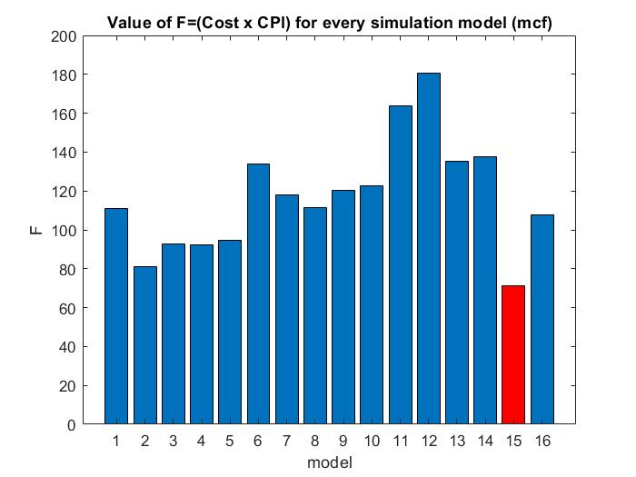

# COMPUTER ARCHITECTURE
## LAB 3 Energy-Delay-Area Product Optimization (gem5 + McPAT)

_Falis Konstantinos_  
_Valasiadou Panagiota_

### **Task 1.a**

There are several factors contributing to the CPU power consumption. They include dynamic power consumption, short-circuit power consumption, and power loss due to transistor leakage currents.

* **Dynamic Power:**  
  The dynamic power consumption originates from the activity of logic gates inside a CPU. When the logic gates toggle, energy is flowing as the capacitors inside them are charged and discharged. The dynamic power consumed by a CPU is approximately proportional to the CPU frequency, and to the square of the CPU voltage.  
  
  
  
    
    where C is capacitance, f is frequency, and V is voltage.

* **Leakage Power:**  
  Power consumption due to leakage power emanates at a micro-level in transistors. Small amounts of currents are always flowing between the differently doped parts of the transistor. The magnitude of these currents depend on the state of the transistor, its dimensions, physical properties and sometimes temperature. The total amount of leakage currents tends to inflate for increasing temperature and decreasing transistor sizes.

>Dynamic power consumption is dependent on the clock frequency, while the leakage current is dependent on the CPU supply voltage. It has been shown that the energy consumption of a program shows convex energy behavior, meaning that there exists an optimal CPU frequency at which energy consumption is minimal.

**Running different programms** to the same CPU(not in parallel) affects the instant clock rate for each programm. So, the instant clock frequency of the cpu is different for each programm. As it was mentioned dynamic power consuption is dependent on the clock frequency, so dynamic power is affected by the program that is running.The affection can be observed by the above formula( : Pdyn = C(V^2)f ).The leakage power is not dependent on the clock frequency but on the supply voltage.We can assume that leakage is static and running different programs will not affect it.

It is well known that power is not dependent on time (power=energy/time).So,the execution time of a program isn't a factor that affects the dynamic power or the leakage power.We only need the execution time for the energy calculation.

### **Task 1.b**
**Energy Efficiency:**  

In computing, performance per watt is a measure of the energy efficiency of a particular computer architecture or computer hardware. Literally, it measures the rate of computation that can be delivered by a computer for every watt of power consumed.

We can conclude that the useful information is the energy that is consumed for a particular progress (Energy=Power*Time).To measure energy efficiency we need the number performance/power. The McPAT can provide the power but not the total energy.We need a performance measure such as the time that a progress takes to end.  

So, in this case we have two processors (5 Watt, 40 Watt) and we need to choose one for a particular system with a constant battery capacity. We can not choose with confidence as there is a possibility for the 40 Watt processor to be more energy efficient than the 5 Watt processor and provide to the system more battery life. To be sure about our choice we need some  information about the performance of the processors. This way we could measure the energy efficiency for each processor. McPAT can't provide these  information as we have mentioned above. 

### **Task 1.c**

* **Xeon(Xeon.xml):**   
performance = 40,  
power= runtime dynamic + total leakage  ->   
Runtime Dynamic= 72.9199 W  
Total Leakage= 36.8319 W  
Power=109.7518 W  
energy_eff= performance/power  
energy_eff= 40/109.7518 = 0.36446

* **ARM A9(ARM_A9_2GHz.xml):**   
performance = 1,   
power= runtime dynamic + total leakage  ->   
Runtime Dynamic= 2.96053 W  
Total Leakage= 0.108687 W  
Power=3.069217 W   
energy_eff= performance/power  
energy_eff= 1/3.069217 = 0.325816  

We can observe that Xeon seems to be more energy efficient than ARM A9. However, we have to take into consideration that the total leakage power in Xeon is big enough. That means that even when the system is idle, there is power consumed due to leakage. The conclusion is that in the long term , the ARM A9 processor is the most energy efficient one(between ARM A9 and Xeon).     

### **Task 2**
The main goal here is to calculate the EDAP (Energy Delay Area product) for every CPU model that we created in the previous lab exercise **(see ./spec_results)**.
To achieve that, we created the xml file **(see ./cpus)** for every CPU model and then used them to get the McPAT results for each one **(see ./mcpat_results)**.

**EDAP**

* Energy : We used the energy value from the outpur results of the print_energy.py scripts **(see ./energy_results)**.
* Delay : We used the execution time of each program , that is the sim_seconds value from the gem5 stats.txt .
* Area: We used the sum of Core:Area and L2:Area of the McPat results.
* **EDAP = Energy(mJ) * Delay(sec) * Area(mm^2)**

- ### **bzip:**

Models	                  |         
---|---|---|---|---
1.specbzip_L1D(16,4)_L1I(8,4)_L2(4,16)_CL(64)  |       1.646686	|    0.020357	 |   0.000194 |       0.178179
2.specbzip_L1D(16,4)_L1I(8,4)_L2(512,8)_CL(64)	|    1.706717	|    0.020353	 |   0.000195	|    0.275318
3.specbzip_L1D(32,2)_L1I(16,2)_L2(2,8)_CL(64)	 |       1.694298	 |   0.017475	 |   0.000066	|    0.218697
4.specbzip_L1D(32,4)_L1I(16,4)_L2(4,16)_CL(64)	  |  1.612626	  |  0.016517	 |   0.000073	|    0.222360
5.specbzip_L1D(64,1)_L1I(32,1)_L2(2,4)_CL(64)	   |     1.645449	 |   0.017756	|    0.000086	|    0.230784
6.specbzip_L1D(64,2)_L1I(32,2)_L2(2,8)_CL(32)	  |      1.775686	|    0.017700	|    0.000074	|    0.407203
7.specbzip_L1D(64,2)_L1I(32,2)_L2(2,8)_CL(64)	   |     1.665609	|    0.014485	|    0.000060	|    0.266691
8.specbzip_L1D(64,2)_L1I(32,2)_L2(2,8)_CL(128)	   | 1.657915	 |   0.014123	|    0.000051	    |0.163292
9.specbzip_L1D(64,2)_L1I(32,2)_L2(4,8)_CL(64)	|        1.647623	|    0.014478	|    0.000060	|    0.230578
10.specbzip_L1D(64,4)_L1I(32,4)_L2(2,16)_CL(64)	 |   1.598381	|    0.013218	 |   0.000067	|    0.316583
11.specbzip_L1D(64,4)_L1I(32,4)_L2(4,16)_CL(64)   | **1.583257**	 |   **0.013213**	 |   **0.000067**	|    **0.282450**
12.specbzip_L1D(128,2)_L1I(64,2)_L2(2,8)_CL(64)	   | 1.635354	|    0.011626	|    0.000055	|    0.337721
13.specbzip_L1D(128,4)_L1I(64,4)_L2(2,8)_CL(64)	  |  1.627679	|    0.010884	 |   0.000054	 |   0.362860
14.specbzip_L1D(128,4)_L1I(64,4)_L2(2,8)_CL(128)	|    1.615151	|    0.009882	|    0.000042	|    0.237956
15.specbzip_L1D(128,4)_L1I(128,4)_L2(2,8)_CL(128)	|    1.615126	 |   0.009882	|    0.000041	|    0.237953
16.specbzip_L1D(128,4)_L1I(128,4)_L2(4,8)_CL(64)	|    1.609739	|    0.010878	|    0.000054	|    0.313748
17.specbzip_L1D(128,8)_L1I(64,8)_L2(2,8)_CL(64)	   | 1.620015	 |   0.010263	|    0.000054	|    0.386927
18.specbzip_L1D(128,8)_L1I(128,8)_L2(4,16)_CL(64)	 |   1.601439	|    0.010255	|    0.000054	|    0.336071
19.specbzip_L1D(64,2)_L1I(32,2)_L2(1,8)_CL(64)   |    1.630251	 |   0.014684	|    0.000074	|    0.318376
20.specbzip_L1D(64,2)_L1I(32,2)_L2(2,8)_CL(256)	   | 1.608190	|    0.015223	|    0.000054	|    0.108392
21.specbzip_L1D(64,4)_L1I(32,4)_L2(2,16)_CL(256)	|    1.592055	 |   0.013797	|    0.000041	 |   0.119960
22.specbzip_L1D(64,4)_L1I(32,4)_L2(4,16)_CL(256)	|    1.583927	|    0.013765	|    0.000041	 |   0.105156
**For the EDAP results click [here](./edap/edap_bzip.txt).**

- ### **hmmer:**
Models |
---|---|---|---|---	
1.spechmmer_L1D(32,2)_L1I(16,2)_L2(2,8)_CL(64)	    |1.189222	 |   0.002368	  |  0.000781	  |  0.051941
2.spechmmer_L1D(64,1)_L1I(32,1)_L2(2,4)_CL(64)	    |1.209620	  |  0.003468	 |   0.000624    |	0.037902
3.spechmmer_L1D(64,2)_L1I(32,2)_L2(2,8)_CL(32)	   | 1.191317	 |   0.003141	  |  0.000218    |	0.081729
4.spechmmer_L1D(64,2)_L1I(32,2)_L2(2,8)_CL(64)	   | 1.184534	 |   0.001638	 |   0.000205    |	0.082233
5.spechmmer_L1D(64,2)_L1I(32,2)_L2(2,8)_CL(128)	   | 1.181712	|    0.000898	|    0.000259	 |   0.076574
6.spechmmer_L1D(64,2)_L1I(32,2)_L2(4,8)_CL(64)	    |1.184534	 |   0.001638	 |   0.000205	  |  0.082233
7.spechmmer_L1D(64,4)_L1I(32,4)_L2(2,16)_CL(64)	  |  1.184085	 |   0.001593	|    0.000102    |	0.086899
8.spechmmer_L1D(128,2)_L1I(64,2)_L2(2,8)_CL(64)	  |  1.182631	 |   0.000719	   | 0.000102    |	0.196151
9.spechmmer_L1D(128,4)_L1I(64,4)_L2(2,8)_CL(64)	   | 1.182121	 |   0.000667	  |  0.000082    |	0.217930
10.spechmmer_L1D(128,4)_L1I(64,4)_L2(2,8)_CL(128)	|    1.179532	|    0.000374	|    0.000059   | 	0.206267
11.spechmmer_L1D(128,4)_L1I(64,4)_L2(2,8)_CL(256)	 |   **1.178365**	 |   **0.000215**	|   **0.000044**    |	**0.192182**
12.spechmmer_L1D(128,4)_L1I(64,4)_L2(4,16)_CL(128)|	1.179532	 |   0.000374	   | 0.000059    |	0.206267
13.spechmmer_L1D(128,4)_L1I(128,4)_L2(2,8)_CL(128)	|1.179532	  |  0.000374	  |  0.000055    |	0.207280
14.spechmmer_L1D(128,8)_L1I(64,4)_L2(2,8)_CL(64)	 |   1.181649	|    0.000548    |	0.000082    |	0.272139
15.spechmmer_L1D(64,2)_L1I(32,2)_L2(1,8)_CL(64)	   | 1.187362	  | 0.001645	   | 0.000205	   | 0.082246
16.spechmmer_L1D(64,2)_L1I(32,2)_L2(2,8)_CL(256)	 |   1.182031	|    0.000563	  |  0.000384  |  	0.059629
17.spechmmer_L1D(64,4)_L1I(32,4)_L2(2,8)_CL(128)	  |  1.182821	 |   0.000859	  |  0.000095  |  	0.085677
18.spechmmer_L1D(64,4)_L1I(32,4)_L2(2,8)_CL(128)	 |   1.182821	|    0.000859   |	0.000095	|    0.085677
19.spechmmer_L1D(128,4)_L1I(32,4)_L2(2,8)_CL(128)	 |   1.181330	|    0.000376    |	0.000095    |	0.198898

>Note: Models 17 and 18 were the same by mistake so we overlooked model 18.

**For the EDAP results click [here](./edap/edap_hmmer.txt).**
- ### **libm:**
Models 	  |             	
---|---|---|---|---
1.speclibm_L1D(32,2)_L1I(16,2)_L2(2,8)_CL(64)	    |    2.623140	|0.060971	|0.000108	|0.999892
2.speclibm_L1D(64,1)_L1I(32,1)_L2(2,4)_CL(64)	     |   2.638071|	0.061561	|0.000113	|0.986435
3.speclibm_L1D(64,2)_L1I(32,2)_L2(2,8)_CL(32)	     |   3.921536|	0.121940	|0.000091	|0.999977
4.speclibm_L1D(64,2)_L1I(32,2)_L2(2,8)_CL(64)	   |     2.623555	|0.060971	|0.000099	|0.999927
5.speclibm_L1D(64,2)_L1I(32,2)_L2(2,8)_CL(128)	   |     1.990434	|0.030487	|0.000122|	0.999835
6.speclibm_L1D(64,2)_L1I(32,2)_L2(4,8)_CL(64)	    |    2.621073	|0.060971	|0.000104	|0.999946
7.speclibm_L1D(64,4)_L1I(32,4)_L2(2,16)_CL(64)	  |      2.623150	|0.060971	|0.000094	|0.999983
8.speclibm_L1D(128,2)_L1I(64,2)_L2(2,8)_CL(64)	    |    2.623565	|0.060971	|0.000096	|0.999976
9.speclibm_L1D(128,4)_L1I(64,4)_L2(2,8)_CL(64)	    |    2.623555	|0.060971	|0.000086	|0.999979
10.speclibm_L1D(128,4)_L1I(64,4)_L2(2,8)_CL(128)	|    **1.990373**	|**0.030487**	|**0.000097**	|**0.999957**
11.speclibm_L1D(128,4)_L1I(128,4)_L2(2,8)_CL(128)	  |  1.990373	|0.030487	|0.000096	|0.999965
12.speclibm_L1D(128,8)_L1I(64,8)_L2(2,8)_CL(64)	    |    2.623555	|0.060971	|0.000086	|0.999982
13.speclibm_L1D(128,4)_L1I(64,4)_L2(2,8)_CL(256)	 |       1.990539	|0.015244	|0.000083	|0.999901
14.speclibm_L1D(128,4)_L1I(64,4)_L2(4,8)_CL(128)	 |       2.576571	|0.030487	|0.000097	|0.999957
15.speclibm_L1D(64,2)_L1I(32,2)_L2(1,8)_CL(64)	    |    3.495281	|0.060971	|0.000099	|0.999927
16.speclibm_L1D(64,2)_L1I(32,2)_L2(2,8)_CL(256)	     |   1.990565	|0.015244	|0.000118	|0.999611

**For the EDAP results click [here](./edap/edap_libm.txt).**

- ### **mcf:**
 Models 	  |       
---|---|---|---|---
1.specmcf_L1D(32,2)_L1I(16,2)_L2(2,8)_CL(64)	|1.469198	|0.002390	|0.059433	|0.023445
2.specmcf_L1D(64,1)_L1I(32,1)_L2(2,4)_CL(64)	|1.118466	|0.002560	|0.004668	|0.202505
3.specmcf_L1D(64,2)_L1I(32,2)_L2(2,8)_CL(64)	|1.099667	|0.002168	|0.000039	|0.701190
4.specmcf_L1D(64,2)_L1I(32,2)_L2(2,8)_CL(32)	|1.117471	|0.003094	|0.000044	|0.836402
5.specmcf_L1D(64,2)_L1I(32,2)_L2(2,8)_CL(128)	|1.072646	|0.001276	|0.000042	|0.554544
6.specmcf_L1D(64,2)_L1I(32,2)_L2(4,8)_CL(64)	|1.091092	|0.002051	|0.000037	|0.720964
7.specmcf_L1D(64,4)_L1I(32,4)_L2(2,16)_CL(64)	|1.090521	|0.001952	|0.000020	|0.764178
8.specmcf_L1D(128,2)_L1I(64,2)_L2(2,8)_CL(64)	|1.090129	|0.001913	|0.000019	|0.780518
9.specmcf_L1D(128,4)_L1I(64,4)_L2(2,8)_CL(64)	|1.089742	|0.001866	|0.000019	|0.797806
10.specmcf_L1D(128,4)_L1I(64,4)_L2(2,8)_CL(128)	|1.071351	|0.001085	|0.000013	|0.664389
11.specmcf_L1D(128,4)_L1I(64,4)_L2(4,8)_CL(128)	|**1.071267**	|**0.001085**	|**0.000013**	|**0.660887**
12.specmcf_L1D(128,4)_L1I(64,4)_L2(4,16)_CL(128)	|1.071267	|0.001085	|0.000013	|0.660887
13.specmcf_L1D(128,4)_L1I(128,4)_L2(2,8)_CL(128)	|1.071351	|0.001085	|0.000013	|0.664456
14.specmcf_L1D(128,8)_L1I(64,8)_L2(2,8)_CL(64)|	1.089662	|0.001857	|0.000019	|0.801627
15.specmcf_L1D(64,2)_L1I(32,2)_L2(1,8)_CL(64)	|1.093448	|0.002051	|0.000037	|0.775969
16.specmcf_L1D(64,2)_L1I(32,2)_L2(2,8)_CL(256)	|1.118754	|0.000946	|0.008173	|0.042457

**For the EDAP results click [here](./edap/edap_mcf.txt).**

- ### **sjeng:**
 Models	  |        
---|---|---|---|---
1.specsjeng_L1D(16,2)_L1I(8,2)_L2(256,8)_CL(128)	|4.976038|	0.060920|	0.000020|	0.999795
2.specsjeng_L1D(16,2)_L1I(8,2)_L2(256,8)_CL(256)	|3.715863|	0.030468|	0.000019|	0.999311
3.specsjeng_L1D(16,2)_L1I(8,2)_L2(512,8)_CL(64)	|7.041117	|0.121847|	0.000019	|0.999648
4.specsjeng_L1D(16,2)_L1I(8,2)_L2(512,8)_CL(256)	|**3.715484**|	**0.030468**|	**0.000019**|	**0.999295**
5.specsjeng_L1D(32,2)_L1I(16,2)_L2(2,8)_CL(256)	|3.715624|	0.030467|	0.000014|	0.999494
6.specsjeng_L1D(32,4)_L1I(16,4)_L2(512,8)_CL(32)|	11.659320|	0.243655|	0.000023|	0.999987
7.specsjeng_L1D(64,1)_L1I(32,1)_L2(2,4)_CL(64)	|7.056733|	0.122577|	0.000016|	0.987860
8.specsjeng_L1D(64,2)_L1I(32,2)_L2(2,8)_CL(32)|	11.658780	|0.243655|	0.000023|	0.999981
9.specsjeng_L1D(64,2)_L1I(32,2)_L2(2,8)_CL(64)|	7.040968|	0.121831|	0.000015|	0.999945
10.specsjeng_L1D(64,2)_L1I(32,2)_L2(2,8)_CL(128)	|4.974909	|0.060928|	0.000011|	0.999563
11.specsjeng_L1D(64,2)_L1I(32,2)_L2(4,8)_CL(64)|	7.039282|	0.121829|	0.000020|	0.999979
12.specsjeng_L1D(64,4)_L1I(32,4)_L2(2,16)_CL(64)	|7.044207|	0.121829|	0.000014|	0.999982
13.specsjeng_L1D(64,4)_L1I(128,4)_L2(4,8)_CL(256)|	3.732418|	0.030461|	0.000006	|0.999958
14.specsjeng_L1D(128,2)_L1I(64,2)_L2(2,8)_CL(64)|	7.040555|	0.121829|	0.000019|	0.999988
15.specsjeng_L1D(128,4)_L1I(64,4)_L2(2,8)_CL(64)	|7.040483|	0.121829|	0.000019|	0.999987
16.specsjeng_L1D(128,4)_L1I(64,4)_L2(2,8)_CL(128)	|4.974735|	0.060917|	0.000012|	0.999978
17.specsjeng_L1D(128,4)_L1I(128,4)_L2(2,8)_CL(128)|	4.974735|	0.060917|	0.000012|	0.999979
18.specsjeng_L1D(128,4)_L1I(128,4)_L2(4,8)_CL(128)|	4.972612|	0.060917|	0.000012|	0.999979
19.specsjeng_L1D(128,8)_L1I(64,8)_L2(2,8)_CL(64)|	7.040555|	0.121829|	0.000018|	0.999987
20.specsjeng_L1D(32,2)_L1I(16,2)_L2(2,8)_CL(64)|	7.040633|	0.121831|	0.000022|	0.999944
21.specsjeng_L1D(64,2)_L1I(32,2)_L2(1,8)_CL(64)	|7.041194|	0.121829|	0.000020|	0.999979
22.specsjeng_L1D(64,2)_L1I(32,2)_L2(2,8)_CL(256)|	3.715489|	0.030461|	0.000011|	0.999903

**For the EDAP results click [here](./edap/edap_sjeng.txt).**

### **Task 2.c**
Here, we will compare the EDAP results from every model with values of the cost function that we defined in the 2nd Lab. The comparison is accomplished with the respective bargraphs, and a scatterplot of the F function vs EDAP for each benchmark.
The scatterplot shows the correlation (r) between the two units , which were standarized to get a more precise presentation since F and EDAP have incomparable values.
- ### **bzip:**
  
  
  >The 2nd model has both the lowest cost-efficiency(F) and EDAP value. Besides that, we cannot see any other pattern about the relation of cost and EDAP.

  
  >The correlation is small, so we can say that the EDAP does not depend on the cost function.

- ### **hmmer:**
  
  

  >Similarly, the same model (15) has both the lowest cost-efficiency(F) and EDAP value. Besides that, we cannot see any other pattern about the relation of cost and EDAP.

  
  >The correlation is the biggest for this benchmark but it is still small, so the two variables have a weak relation.

- ### **libm:**
  
  

  >Here, the most cost efficient model has a relatively high EDAP and vice versa.

  
  >The correlations is small and negative. So, by comparing to the other benchamrks we can only tell that there is no dependency.

- ### **mcf:**
  
  
  

  >Here, the correlation coefficient is so small that it is clear that the two variables are completely independent.

  - ### **sjeng:**
  
  
  

  >The same applies here, there is no relation between EDAP and the cost function.

Although we expected to see some relation between the two measures since they both include a performance unit (CPI and Delay),
our calculations showed that there is **no clear dependency** between the cost function 
**F = cost * CPI** and the **EDAP = Energy * Delay * Area**, 
 meaning that the cost of a CPU does not depend on the area it covers or the energy it consumes,

### **Conclusion/Review**
>This lab exercise introduced us to the concepts of CPU power, Energy efficiency and EDAP optimization , with the help of McPAT.
- **Task 1:** It was easy to find information about the power consumed in a CPU and it only required some effort to understand how is energy efficiency defined. 
- **Task 2:** Gathering and presenting the results of mcpat took quite some time and repetitive work, while all benchmarks lead to the same conclusions. It would be preferable to use only one or two of them for this lab.
### **Bibliography/Useful Links:**
 

